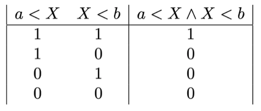
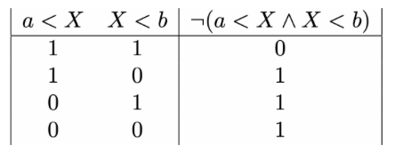

# Negating propositions involving and

Now that you can negate basic logical propositions lets see if we can work out how to negate the compound propositions that can be constructed using the logical conjunction.  We shall start this process by remembering that the truth table for the logical conjunction is:  

Now recall that the negation of a proposition is the proposition that is true whenever the original proposition is false.  The truth table for the negation for the logical proposition involving the logical construction operator above is:

__To complete the exercise you need to use the ideas above to complete the `negationBetween` function in the panel on the left__.  The two functions on the panel in the left take the following arguments:

1. `data` - a numpy array that contains multiple integers
2. `a` - an integer
3. `b` - an integer that is greater than `a`

The function I have written for you `numberBetween` returns the number of elements in `data` that are greater than `a` and less than `b`.  The `negationBetween` function that you will write should return the number of elements in `data` for which the negation of the logical proposition in `numberBetween` is true.

__The key thing that you will need to recognise in order to complete this task is that you can construct the truth table for the negation of a proposition involving and (which I have provided above) in another way if you start from the negations of the two proposition from which the compound proposition was formed.__
